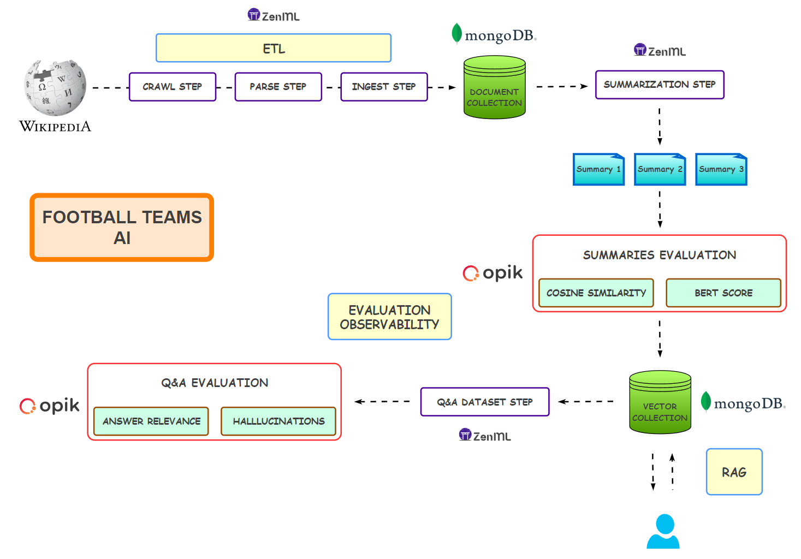

# Football Teams AI Evaluation and Observability

<p align="center">
    
  </a>
</p>

A **modular pipeline** for evaluating and observing the performance of large language models (LLMs) applied to football teams' content. This project uses Wikipedia data about football teams to **generate summaries, create QA datasets**, and **evaluate model responses** using state-of-the-art tools:

- **ZenML** for pipeline orchestration and experiment tracking
- **MongoDB** for structured storage and vector-based retrieval
- **Opik** for LLM evaluation and observability

Designed for **research**, **benchmarking**, and **experimentation**, the system is fully configurable, supports **semantic search**, and enables fine-grained analysis of LLM behavior across a range of evaluation metrics.

## Overview

- **ETL Pipeline**: Crawl, parse, and ingest Wikipedia articles into MongoDB.
- **Summarization Pipeline**: Generate summaries for each article using LLMs.
- **Evaluation Pipelines**: Score summaries and QA datasets using BERTScore, cosine similarity, and Opik metrics.
- **Experiment Tracking**: Integrated with **ZenML** and **Opik** for experiment and metric visualization.
- **Configurable**: Customize settings via YAML and environment variables.

## Project Structure

```text
├── .github                    # CI pipeline
├── src
│   ├── configs/               # Configs, prompts, and settings
│   ├── data/                  # Evaluation data and crawled team data
│   ├── evaluation/            # Summary & QA evaluation scripts
│   ├── infra/                 # MongoDB vector index utilities
│   ├── pipelines/             # ZenML pipeline entrypoints
│   ├── search/                # Search observability utility
│   ├── steps/                 # ZenML steps: ETL, dataset, summaries
├── tests/                     # Unit tests
├── .pre-commit-config.yaml    # Pre-commit hooks
├── LICENSE                    # License
├── Makefile                   # Makefile commands
├── README.md                  # Project description
├── pyproject.toml             # Project dependencies
```

## Getting Started

### Prerequisites

- Python 3.12+
- [uv](https://github.com/astral-sh/uv)
- [ZenML](https://zenml.io/)
- [Opik](https://www.comet.com/site/products/opik/)
- [MongoDB](https://www.mongodb.com/)

### Installation

1. **Clone the repository**

   ```bash
   git clone https://github.com/benitomartin/llm-observability-opik.git
   cd llm-observability-opik
   ```

1. **Install dependencies**

   ```bash
   uv sync --all-groups
   source ./.venv/bin/activate
   ```

1. **Configure environment**

   Copy `.env.example` to `.env` and update with your credentials:

   ```bash
   cp .env.example .env
   ```

1. **Create MongoDB Account**

   Create an account at [MongoDB](https://www.mongodb.com/) and a and free cluster:

   - Get your `MONGODB_URI` and update your `.env` file accordingly

   - The project uses two collections:

     - One for storing Wikipedia articles and summaries

     - Another with vector indexes and embeddings for similarity search

1. **Create an Opik/Comet ML Account**

   Create an account at \[[Opik](https://www.comet.com/site/products/opik/)\], which is the evaluation platform from Comet ML:

   - Get your `API_KEY` and configure it following this instructions (https://www.comet.com/docs/opik/tracing/sdk_configuration) with the `opik configure` command.

## Usage

### Pipelines

- **Start ZenML**

  ```bash
  make zenml-login
  ```

- **ETL pipeline**

  ```bash
  make run-team-pipeline
  ```

- **Summarization pipeline**

  ```bash
  make run-summarization-pipeline
  ```

### Evaluation

- **Evaluate summaries with Opik**

  Evaluate the summaries using BERT Score and Cosine Similarity:

  ```bash
  make run-evaluate-summaries
  ```

- **Evaluate QA dataset**

  Evaluate a synthetic Q&A dataset on Hallucinations and Answer Relevancy:

  ```bash
  make run-evaluate-dataset
  ```

### Search Tracing

```bash
run-tracing
```

### Testing

- **Evaluate summaries with Opik**

  ```bash
  make run-tests
  ```

### Dev Tools

- **Lint, format, type-check and clean up**

  ```bash
  make all
  ```

## Configuration

You can configure the following:

- MongoDB connection
- OpenAI API and model names
- Evaluation dataset paths

Edit:

- `src/configs/settings.py`
- `src/configs/config.yaml`

## Experiment Tracking

- **ZenML Dashboard**: [http://127.0.0.1:8237](http://127.0.0.1:8237)
- **Opik**: [Opik](https://www.comet.com/site/products/opik/)
- **MongoDB**: [MongoDB](https://www.mongodb.com/)

## 📄 License

[MIT License](LICENSE)
